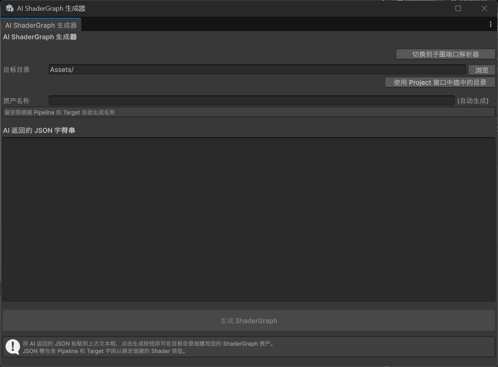
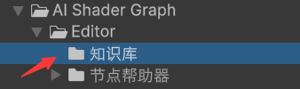
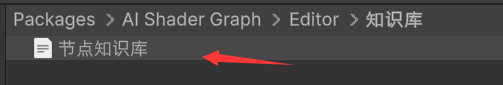
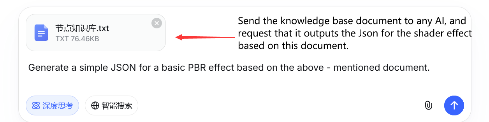
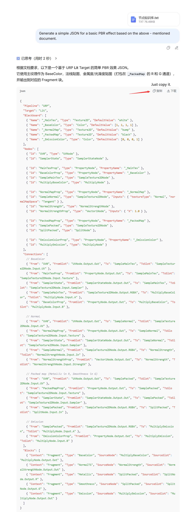
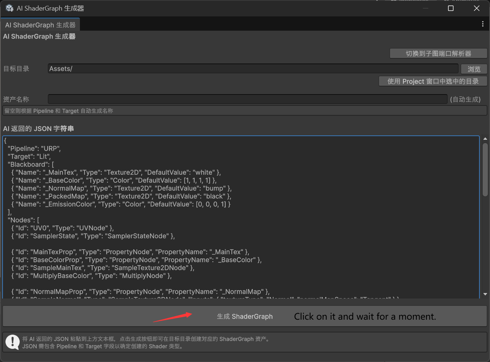
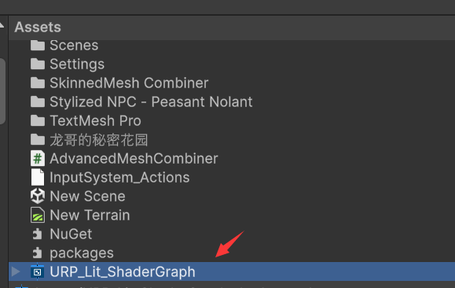
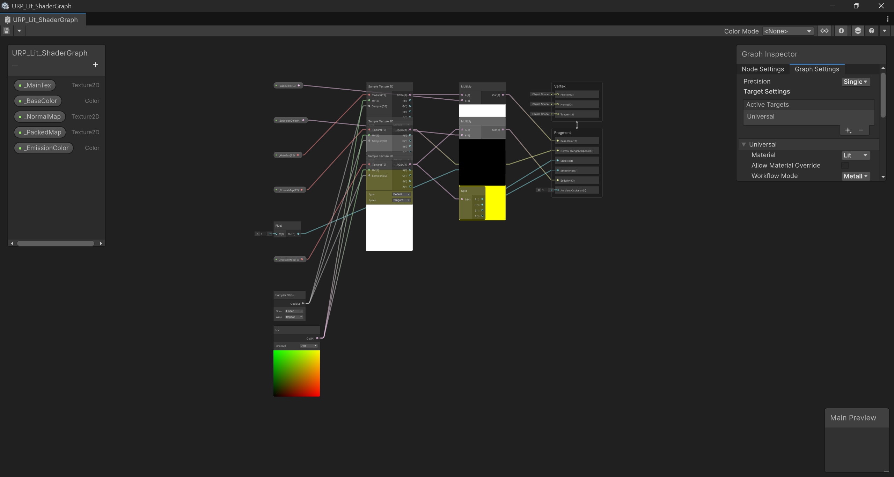

# AI ShaderGraph Generator

**AI 驱动的 Unity ShaderGraph 自动生成工具**

将 AI（如 DeepSeek、ChatGPT）生成的 JSON 描述一键转换为完整的 Unity ShaderGraph 资产，支持 URP 和 Built-In 渲染管线，覆盖 100+ 节点类型。

---

## 功能特性

- **AI → ShaderGraph** — 解析 AI 返回的 JSON 结构，自动创建节点、连接、黑板属性和管线配置
- **多管线支持**
  - **URP**: Lit / Unlit / Fullscreen / Canvas / SixWay / Decal / SpriteLit / SpriteUnlit / SpriteCustomLit
  - **Built-In**: Lit / Unlit / Canvas
- **100+ 节点类型** — 覆盖 Input、Math、Artistic、Procedural、UV、Logic 等全类别
- **子图系统** — 端口解析、代码生成、Base64 嵌入式自动重建，跨项目共享子图
- **自动布局** — 拓扑排序 + 最长路径算法，节点自动排列，数据流从左到右
- **可视化窗口** — AI ShaderGraph 生成器 + 子图端口解析器，双击即用
- **渲染状态精细控制** — 表面类型、混合模式、深度测试、面剔除、Alpha Clip 等
- **Unity MCP 集成** — 通过 `aishader_build_json` 和 `aishader_get_knowledge` 两个 MCP 工具直接对接 AI 客户端，无需手动粘贴 JSON

---

## Unity MCP 集成（v1.1.0 新增）

将本工具注册为 Unity MCP 工具，AI 可以直接调用 `aishader_build_json` 和 `aishader_get_knowledge`，**无需手动复制知识库或粘贴 JSON**。

### 前提条件

| 依赖 | 说明 |
|------|------|
| `com.unity.ai.assistant`（**仅 2.5.0-pre.2**） | 提供 Unity MCP Bridge。后续版本（2.5.0-pre.2 以上）**需要 Unity AI 许可证才允许 MCP 连接**，因此本包锁定此版本 |
| MCP 客户端（OpenCode / Cursor / Claude Code） | 连接 Unity，调用 MCP 工具 |

> 注意：不安装 AI Assistant 不影响 ShaderGraph 生成器和 RunCommand 功能。

### 卸载 MCP 集成

如果不需要 MCP 功能，按以下步骤移除（避免编译错误）：

1. 删除 `Editor/McpBridge.cs` 和 `Editor/McpBridge.cs.meta`
2. 打开 `Editor/com.longwa.aishadergraph.Editor.asmdef`，删除 `"Unity.AI.MCP.Editor"` 引用
3. 打开 `package.json`，删除 `"com.unity.ai.assistant": "2.5.0-pre.2"` 依赖即可

### MCP 工具

| 工具名 | 参数 | 说明 |
|--------|------|------|
| `aishader_build_json` | `assetPath`（资产路径）, `json`（JSON 描述） | 从 JSON 一键创建 ShaderGraph 资产 |
| `aishader_get_knowledge` | `category`（`format`/`nodes`/`search`/`node`）, `keyword`, `nodeType` | 按需查询节点类型、槽位、参数、JSON Schema |

### 知识库查询模式

| `category` 值 | 额外参数 | 返回内容 |
|--------------|---------|---------|
| `format` | — | JSON Schema + Pipeline/Target/Block 参考 |
| `nodes` | — | 全部 ~200 个节点类型 + 槽位 + 参数 |
| `search` | `keyword=noise` | 按关键词匹配的节点子集 |
| `node` | `nodeType=SimpleNoiseNode` | 单个节点的详细信息 |

### 连接 OpenCode

在项目根目录创建 `opencode.json`：

```json
{
  "mcp": {
    "unity-mcp": {
      "type": "local",
      "command": ["%USERPROFILE%\\.unity\\relay\\relay_win.exe", "--mcp"],
      "enabled": true,
      "timeout": 30000
    }
  },
  "instructions": [
    "创建 ShaderGraph 时优先调用 aishader_get_knowledge(category='format') 获取 Schema，然后调用 aishader_get_knowledge(category='search', keyword='...') 查找相关节点。组装 JSON 后调用 aishader_build_json 构建图。复杂场景（如 CustomFunctionNode）可用 RunCommand 作为 fallback。"
  ]
}
```

### AI 工作流

```
用户："创建一个体积云着色器"
  → AI 调用 aishader_get_knowledge(category="search", keyword="noise")
  → AI 获取噪声节点列表，选择 SimpleNoiseNode + SmoothstepNode
  → AI 调用 aishader_get_knowledge(category="format")
  → AI 获取 Schema 格式参考
  → AI 组装 JSON（Pipeline + Blackboard + Nodes + Connections + Blocks）
  → AI 调用 aishader_build_json(assetPath="Assets/Shaders/Clouds.shadergraph", json="{...}")
  → ShaderGraph 创建完成，Unity 自动刷新
```

### 双轨架构

| 轨道 | 方式 | 适用场景 |
|------|------|---------|
| **A** | `aishader_build_json`（MCP 直接调 API） | 标准图构建，无需编译 |
| **B** | `RunCommand`（编译 + 执行 C# 脚本） | 复杂自定义逻辑、CustomFunctionNode |
| **C** | AI ShaderGraph 生成器窗口（手动粘贴 JSON） | 不是 MCP 客户端时的备选方案 |

### 架构安全性

`com.unity.ai.assistant@2.5.0-pre.2` 已在 `package.json` 中声明为依赖。Unity Package Manager 自动解析安装 → `Unity.AI.MCP.Editor` 程序集始终可用 → `McpBridge.cs` 正常引用 `[McpTool]` / `[McpDescription]` 编译注册。

---

## 环境要求

| 依赖 | 版本 |
|------|------|
| Unity | 6000.0.68f1 或更高 |
| 渲染管线 | URP 或 Built-In |
| Shader Graph | 内置包（随 Unity 安装） |

---

## 安装

### 方式一：Package Manager (Git URL)

Unity 菜单 → **Window > Package Manager** → 左上角 `+` → **Add package from git URL**：

```
https://github.com/1ongwa2021/AIshaderGraph.git
```

### 方式二：本地导入

将本仓库克隆或下载到 Unity 项目的 `Packages/` 目录下。

---

## 快速开始

### 方式一：Unity MCP（推荐，v1.1.0+ 需要 com.unity.ai.assistant）

1. 确保项目已安装 `com.unity.ai.assistant@2.5.0-pre.2`，Unity MCP Bridge 运行中（绿色）
2. 配置 MCP 客户端（如 OpenCode），连接 Unity MCP 继电器
3. 直接对 AI 说："创建一个 PBR 着色器存到 Assets/PBR.shadergraph"
4. AI 自动调用 `aishader_get_knowledge` 查询节点 → 组装 JSON → 调用 `aishader_build_json` → 完成

### 方式二：手动窗口（传统方法）

#### 1. 打开生成器
Tools > 龙哥的秘密花园 > AI ShaderGraph 生成器


### 2. 获取知识库内容
拿去知识库文档，提供给 AI 作为参考



### 3. 让 AI 生成 JSON
把知识库 + 你想要的 shader 效果描述发送给 AI，复制它返回的 JSON



### 4. 粘贴 JSON 并生成
粘贴 JSON → 选择目标目录 → 点击生成



### 5. 验证 ShaderGraph
双击生成的 .shadergraph 资产，检查节点是否正确



### JSON 格式示例

```json
{
  "Pipeline": "URP",
  "Target": "Lit",
  "Blackboard": [
    { "Name": "_MainTex", "Type": "Texture2D", "DefaultValue": "white" },
    { "Name": "_BaseColor", "Type": "Color", "DefaultValue": [1.0, 1.0, 1.0, 1.0] },
    { "Name": "_Metallic", "Type": "Float", "DefaultValue": 0.0 },
    { "Name": "_Smoothness", "Type": "Float", "DefaultValue": 0.5 }
  ],
  "Nodes": [
    { "Id": "UV0", "Type": "UVNode" },
    { "Id": "Time", "Type": "TimeNode" },
    { "Id": "MainTex", "Type": "PropertyNode", "PropertyName": "_MainTex" },
    { "Id": "SampleTex", "Type": "SampleTexture2DNode" },
    { "Id": "Multiply", "Type": "MultiplyNode" },
    { "Id": "BaseColor", "Type": "PropertyNode", "PropertyName": "_BaseColor" }
  ],
  "Connections": [
    { "From": "UV0", "FromSlot": "UVNode.Output.Out", "To": "SampleTex", "ToSlot": "SampleTexture2DNode.Input.UV" },
    { "From": "Time", "FromSlot": "TimeNode.Output.Time", "To": "Multiply", "ToSlot": "MultiplyNode.Input.A" },
    { "From": "SampleTex", "FromSlot": "SampleTexture2DNode.Output.RGBA", "To": "Multiply", "ToSlot": "MultiplyNode.Input.B" }
  ],
  "Blocks": [
    { "Slot": "BaseColor", "Source": { "NodeId": "Multiply", "SlotName": "MultiplyNode.Output.Out" } }
  ],
  "GraphSettings": {
    "SurfaceType": "Opaque",
    "BlendMode": "Alpha",
    "RenderFace": "Front",
    "AlphaClip": false
  }
}
```

---

## 项目结构

```
AIshaderGraph/
├── package.json              # UPM 包清单
├── README.md                 # 本文档
├── Editor/
│   ├── com.longwa.aishadergraph.Editor.asmdef   # Editor 程序集
│   ├── 知识库/
│   │   ├── 节点知识库.txt                       # 完整节点参考（供手动使用）
│   │   └── knowledge_summary.json              # 结构化节点清单（供 MCP 工具读取）
│   ├── McpBridge.cs                             # MCP 工具注册（aishader_build_json + aishader_get_knowledge）
│   ├── 节点帮助器/节点/
│   │   ├── AIShaderGraphGeneratorWindow.cs  # 主窗口
│   │   ├── ColorNodeParams.cs               # 节点参数类
│   │   ├── ShaderGraphNodeType.cs           # 节点类型枚举
│   │   ├── Slots.cs                         # 插槽定义
│   │   └── 重构项目/                        # 重构核心
│   │       ├── ShaderGraphBuilder.cs        # JSON → ShaderGraph 构建引擎
│   │       ├── GraphDataContext.cs          # 图操作上下文
│   │       ├── ShaderGraphReflectionHelper.cs # 反射基础设施
│   │       ├── NodeLayoutHelper.cs          # 自动布局算法
│   │       ├── NodeParameterConverter.cs    # 参数转换器
│   │       ├── ShaderPropertyFactory.cs     # 黑板属性工厂
│   │       ├── URPShaderGraphHelper.cs      # URP 管线辅助
│   │       ├── BuiltInShaderGraphHelper.cs  # Built-In 管线辅助
│   │       └── 子图/                        # 子图系统
│   │           ├── SubGraphResolver.cs      # 子图解析器
│   │           ├── SubGraphPortsAttribute.cs # 子图端口标记
│   │           ├── EnumConverter.cs         # 枚举转换
│   │           └── 子图编辑器/              # 子图可视化编辑
│   │               ├── SubGraphParserWindow.cs  # 端口解析窗口
│   │               ├── SubGraphBuilder.cs       # 子图构建器
│   │               ├── SubGraphRebuilder.cs     # Base64 重建器
│   │               ├── SubGraphJsonExporter.cs  # JSON 导出器
│   │               └── SubGraphDataTypes.cs     # 数据结构类型
│   └── CreateUnlitShaderGraphPureReflection.cs # 测试与示例
└── Tests/                     # 测试目录
```

---

## 架构概览

```
AI JSON ──► ShaderGraphBuilder
                │
                ├── GraphDataContext (操作上下文 + 资产缓存)
                │       ├── ShaderGraphReflectionHelper (反射层)
                │       ├── URPShaderGraphHelper / BuiltInShaderGraphHelper
                │       ├── ShaderPropertyFactory (黑板属性)
                │       └── NodeLayoutHelper (自动布局)
                │
                └── 输出: .shadergraph 资产
```

- **ShaderGraphBuilder**: 核心入口，解析 JSON，按步骤构建完整图
- **GraphDataContext**: 单个资产的上下文，管理节点添加/连接/保存
- **ShaderGraphReflectionHelper**: 通过反射访问 ShaderGraph 内部 API（类型查找、GraphData 序列化）
- **管线辅助**: 封装 URP/Built-In 的 Target 激活、SubTarget 设置、块节点管理
- **子图系统**: 支持解析子图端口、生成 C# 嵌入式代码、Base64 自动重建

---

## 子图系统

### 端口解析器

Unity 菜单 → **Tools > 龙哥的秘密花园 > 子图端口解析器**

选择一个 `.shadersubgraph` 资产，自动解析其输入/输出端口，生成包含 Base64 的 C# 静态类代码，支持跨项目自动重建子图。

### 嵌入式重建

在代码中添加 `[SubGraphPorts]` 特性标记静态类，嵌入子图数据的 Base64 字符串。当解析器找不到子图资产时，自动从嵌入数据重建。

---

## 开发

本项目为 Editor-only 程序集，所有代码仅在 Unity Editor 中运行，不影响运行时构建。

如需添加新的 ShaderGraph 节点类型：
1. 在 `ShaderGraphNodeType.cs` 添加枚举值
2. 在 `Slots.cs` 中定义插槽常量
3. 在 `NodeParameterConverter.cs` 添加参数映射
4. （可选）在 `ColorNodeParams.cs` 添加参数类

---

## 已知问题

### 安装后触发 `CS0103: 'Unsafe' does not exist` 编译错误

**现象**：安装本包（或 `com.unity.ai.assistant`）后报错：

```
Library\PackageCache\com.unity.collections@<hash>\Unity.Collections\xxHash3.cs(650,61): error CS0103: The name 'Unsafe' does not exist in the current context
```

**原因**：`com.unity.entities@1.4.x` → `com.unity.collections@2.6.7` + Unity 6000 → Burst API 不兼容。安装新包触发全量重编译暴露此问题。清除编译缓存无法解决，每次重编都会触发。

**解决方案**（任选其一）：

| 方案 | 操作 |
|------|------|
| **A** | 移除 `com.unity.entities` 系列包 → `com.unity.collections` 可自由降级到 `2.5.1` |
| **B** | 移除本包和 `com.unity.ai.assistant` → 不触发全量重编 → 错误不暴露 |

> 两个包族（ECS + AI Assistant）同时存在时冲突，选择移除其中一个即可。

---

## 许可证

MIT